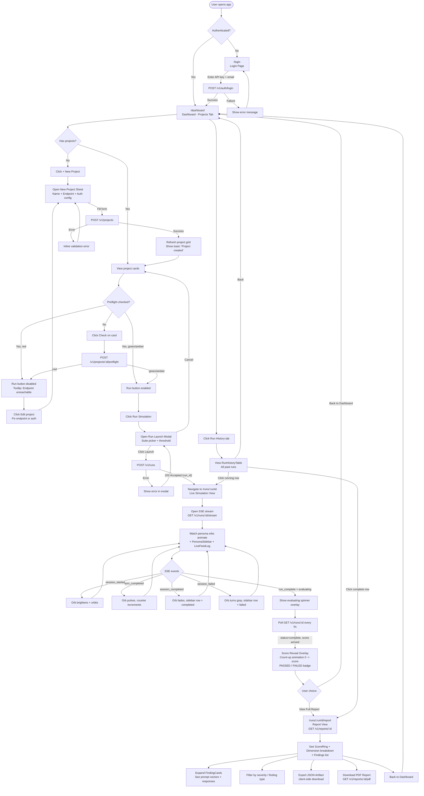

# LitmusAI — User Flow Diagram

## Full User Journey (Mermaid)



---

## Feature Access Map (by screen)

```
Feature                          Screen(s)                        API Call
───────────────────────────────────────────────────────────────────────────────
Create project                   Dashboard (Sheet)                POST /v1/projects
Edit project                     Dashboard (Sheet, edit mode)     PATCH /v1/projects/:id
List projects                    Dashboard (Projects tab)         GET /v1/projects
Run preflight check              Project card (inline)            POST /v1/projects/:id/preflight
Launch simulation run            Run Launch Modal                 POST /v1/runs
Watch live simulation            /runs/:runId                     GET /v1/runs/:id/stream (SSE)
Poll run status (fallback)       /runs/:runId                     GET /v1/runs/:id
View score reveal                /runs/:runId (overlay)           GET /v1/runs/:id (poll)
View full report                 /runs/:runId/report              GET /v1/reports/:id
Filter findings                  Report view (client-side)        —
Export JSON                      Report view (client-side)        —
Download PDF                     Report view                      GET /v1/reports/:id/pdf
View run history                 Dashboard (Run History tab)      GET /v1/projects + GET /v1/runs
Navigate to live run             Run History table row            —
Navigate to completed report     Run History table row            —
```

---

## CI/CD Integration Flow (non-UI, for reference)

```
Developer machine / GitHub Actions
        │
        ▼
POST /v1/runs          ← triggered by litmusai/test-action
        │
        ▼
Poll GET /v1/runs/:id  ← every 30s, max 15 min
        │
        ├── status = complete, passed = true  → exit 0 (CI passes)
        └── status = complete, passed = false → exit 1 (CI fails)
                                              + post score to PR comment
```

---

## State Transitions (Run Lifecycle)

```
         ┌─────────────────────────────────────────────────────┐
         │                    RUN LIFECYCLE                     │
         └─────────────────────────────────────────────────────┘

  [POST /v1/runs]
        │
        ▼
    ┌────────┐
    │ QUEUED │  ← run_doc inserted, Celery task dispatched
    └────────┘
        │  Celery worker picks up task
        ▼
    ┌─────────┐
    │ RUNNING │  ← SimulationRun.execute() starts
    └─────────┘  SSE events: session_started, turn_completed,
        │        session_completed, session_failed
        │  All sessions finish
        ▼
    ┌────────────┐
    │ EVALUATING │  ← EvaluationEngine runs (Phase 6)
    └────────────┘  LLM judge scores each turn, findings written to KB
        │  Scoring complete
        ▼
    ┌──────────┐     ┌────────┐
    │ COMPLETE │     │ FAILED │  ← on unrecoverable error
    └──────────┘     └────────┘
    score set,       score = null
    report ready     error logged

Dashboard UI reflects each state:
  QUEUED      → gray spinner badge in RunHistoryTable
  RUNNING     → blue pulse badge, live canvas accessible
  EVALUATING  → amber pulse badge, evaluating spinner overlay on canvas
  COMPLETE    → green badge with score, report link active
  FAILED      → red badge, no report
```

---

## Error States & Recovery Flows

```
Error                        UI Response                    Recovery Path
────────────────────────────────────────────────────────────────────────────────
Project create fails         Inline form error             Fix fields, resubmit
Preflight returns red        Run btn disabled, red dot      Edit project endpoint/auth
Run create fails             Error in modal                 Fix and retry
SSE disconnects mid-run      Auto-reconnect (3 retries)    Falls back to polling
SSE fails completely         Switch to polling mode         Poll every 5s
Run status = failed          Red badge in history           No recovery, start new run
Report not found             404 page with back button      Navigate to dashboard
```
